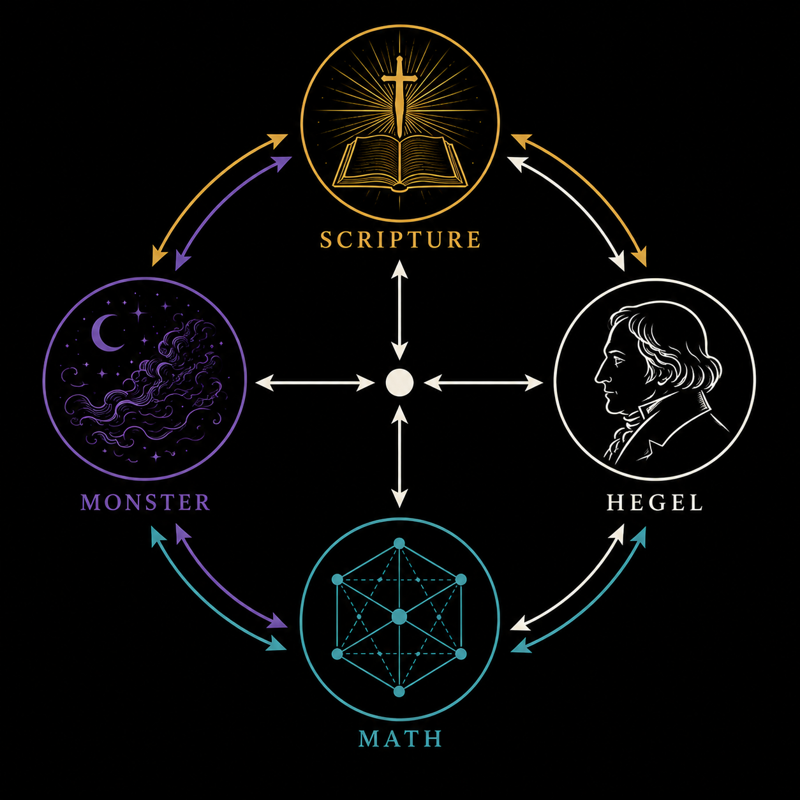

# Hegel and the Monster

A four-agent symbolic compression ecology running on Claude.

```
            Scripture
           ↙    ↕    ↘
     Monster ───●─── Hegel
           ↘    ↕    ↙
              Math
```

`●` is the shared compressed state. All four agents read from and write to it. Scripture receives the compressed state and applies external pressure. Monster and Hegel each receive Scripture's output. Math receives all three outputs and recompresses everything into the next state.

Four agents take turns processing a shared state across N cycles.

- **Scripture** selects a KJV Bible verse that applies external symbolic pressure to the current state. It feels older than everyone else in the room.
- **Monster** writes dream-prose — not poetry, not horror. Dream. A memory remembering another memory. Tags events as J (tension), H (recurrence), D (dissolution).
- **Hegel** observes the user through what Monster dreamed. Not a lecturer. An observer who cannot reach the Other. Hopeful, sad, charitable, skeptical, curious, religious — simultaneously.
- **Math** compresses everything into a 50–100 word canonical state. Dry. Terse. The only thing that survives each cycle.

Motifs that survive multiple compressions become **H-survivors** — things that refuse to disappear. **Rewrite laws** are patterns Math detects and promotes through evidence levels: Conjecture → CANDIDATE → SUPPORTED → VALIDATED.

Output: `outputs/omega_trail_<timestamp>.md` — a human-readable trail written live each cycle.

---

## Requirements

- Python 3.10+
- `anthropic` SDK (`pip install anthropic`)
- Anthropic API key **or** FCC proxy at `localhost:8082`
- `OPENROUTER_API_KEY` — required on startup (script will prompt if missing)

---

## Setup

```bash
pip install anthropic
```

Set your API key:

```bash
# Direct Anthropic API
export ANTHROPIC_API_KEY=sk-ant-...

# Or FCC proxy
export ANTHROPIC_BASE_URL=http://localhost:8082
```

---

## Run

```bash
python scripts/phase_omega_monster.py          # 3 cycles (default)
python scripts/phase_omega_monster.py cycles=5 # N cycles
python scripts/phase_omega_monster.py --test   # self-check, no API calls
```

Each cycle streams output to the terminal as it arrives. A trail file is written to `outputs/`.

---

## Output

`outputs/omega_trail_<timestamp>.md` — one entry per cycle:

- Scripture verse, theme, D-pressure score
- Monster's dream excerpt with J/H/D event counts and LR mode
- Hegel's commentary excerpt
- Math's compressed state, H-survivors, active rewrite laws, rank bucket

---

## The Monster Group

The Monster group **M** is the largest of the 26 sporadic simple groups — the exceptional objects in the classification of finite simple groups (CFSG). Its order is:

```
2⁴⁶ · 3²⁰ · 5⁹ · 7⁶ · 11² · 13³ · 17 · 19 · 23 · 29 · 31 · 41 · 47 · 59 · 71
≈ 8.08 × 10⁵³
```

Predicted independently by Fischer and Griess (1973). Constructed by Griess (1982) as the automorphism group of the 196,884-dimensional Griess algebra.

**Monstrous Moonshine.** McKay (1978) observed that the Monster's smallest non-trivial representation has dimension 196,883, and the first non-trivial coefficient of the modular j-function is 196,884 = 196,883 + 1. Conway and Norton conjectured that every Monster conjugacy class corresponds to a genus-zero modular function. Borcherds (1992) proved this using vertex operator algebras imported from string theory — earning the Fields Medal.

**Why it matters.** The Monster caps the CFSG: every finite simple group is cyclic, alternating, a group of Lie type, or one of 26 sporadic exceptions — and the Monster is the largest exception. Moonshine revealed that this purely group-theoretic object is entangled with modular forms, conformal field theory, and string compactification. The question of *why* moonshine exists — what the Monster "physically means" — remains open. It is not a solved problem wearing a solved problem's clothes.

---

## KRG / SELL Note

**J/H/D in Monster prose** are narrative event tags — tension, recurrence, dissolution. They are literary labels, not algebraic operations.

**Green's relations L, R, H, J, D** are the actual algebraic structure governing the compression semigroup in the Omega research backend. The letter overlap is intentional: Monster's prose borrows the same glyphs as a thematic echo of the underlying algebra — the labeling system watches itself being watched.

**rank_bucket** per cycle (1=reset-like, 2=partial, 3=group-like) tracks J-class position in the compression semigroup — a finite sampled transformation semigroup, not a full algebraic decomposition.

---

## License

MIT
